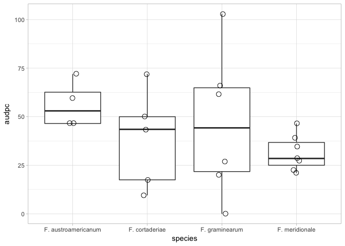

# Cálculo da AUDPC em experimentos com repetição
Emerson  
10/24/2017  


## Epidemiologia comparativa

###  O experimento

No exemplo, um experimento foi conduzido em condições controladas para comparar diferentes espécies de um fungo patogênico quanto capacidade de causar maiou ou menor intensidade de doença após a inoculação em uma espigueta central da espiga. Quatro avaliações foram feitas em intervalos variados de dias após a inoculação, até o vigésimo dia. 

Os dados foram planilhados no formato "longo" no arquivo `data_audpc.xlsx`. Ao carregar o arquivo, pode-se notar quatro colunas: 

- dai: dias após a avaliação
- species: nome da espécie do fungo
- spike: número da espiga inoculada
- above: número de espiguetas acima do ponto de inoculação


```r
library(readxl)
data1 <- read_excel("data_audpc.xlsx")
library(knitr)
kable(data1)
```


 dai  species                spike   above
----  --------------------  ------  ------
   4  F. austroamericanum        1       1
   4  F. austroamericanum        2       2
   4  F. austroamericanum        3       2
   4  F. austroamericanum        4       2
   7  F. austroamericanum        1       4
   7  F. austroamericanum        2       4
   7  F. austroamericanum        3       3
   7  F. austroamericanum        4       3
  11  F. austroamericanum        1       4
  11  F. austroamericanum        2       5
  11  F. austroamericanum        3       3
  11  F. austroamericanum        4       3
  20  F. austroamericanum        1       4
  20  F. austroamericanum        2       5
  20  F. austroamericanum        3       3
  20  F. austroamericanum        4       3
   4  F. cortaderiae             1       1
   4  F. cortaderiae             2       0
   4  F. cortaderiae             3       1
   7  F. cortaderiae             1       1
   7  F. cortaderiae             2       1
   7  F. cortaderiae             3       2
  11  F. cortaderiae             1       4
  11  F. cortaderiae             2       1
  11  F. cortaderiae             3       2
  20  F. cortaderiae             1       4
  20  F. cortaderiae             2       4
  20  F. cortaderiae             3       2
   4  F. cortaderiae             1       4
   4  F. cortaderiae             2       0
   4  F. cortaderiae             3       2
   7  F. cortaderiae             1       4
   7  F. cortaderiae             2       3
   7  F. cortaderiae             3       2
  11  F. cortaderiae             1       4
  11  F. cortaderiae             2       3
  11  F. cortaderiae             3       2
  20  F. cortaderiae             1       4
  20  F. cortaderiae             2       3
  20  F. cortaderiae             3       2
   4  F. cortaderiae             1       1
   4  F. cortaderiae             2       2
   7  F. cortaderiae             1       3
   7  F. cortaderiae             2       4
  11  F. cortaderiae             1       4
  11  F. cortaderiae             2       4
  20  F. cortaderiae             1       4
  20  F. cortaderiae             2       4
   4  F. cortaderiae             1       0
   4  F. cortaderiae             2       0
   7  F. cortaderiae             1       0
   7  F. cortaderiae             2       0
  11  F. cortaderiae             1       0
  11  F. cortaderiae             2       0
  20  F. cortaderiae             1       0
  20  F. cortaderiae             2       1
   4  F. cortaderiae             1       2
   4  F. cortaderiae             2       2
   7  F. cortaderiae             1       2
   7  F. cortaderiae             2       3
  11  F. cortaderiae             1       2
  11  F. cortaderiae             2       3
  20  F. cortaderiae             1       3
  20  F. cortaderiae             2       4
   4  F. cortaderiae             1       0
   4  F. cortaderiae             2       0
   4  F. cortaderiae             3       1
   7  F. cortaderiae             1       0
   7  F. cortaderiae             2       3
   7  F. cortaderiae             3       1
  11  F. cortaderiae             1       0
  11  F. cortaderiae             2       3
  11  F. cortaderiae             3       1
  20  F. cortaderiae             1       0
  20  F. cortaderiae             2       3
  20  F. cortaderiae             3       1
   4  F. cortaderiae             1       0
   4  F. cortaderiae             2       0
   4  F. cortaderiae             3       0
   4  F. cortaderiae             4       0
   7  F. cortaderiae             1       0
   7  F. cortaderiae             2       0
   7  F. cortaderiae             3       0
   7  F. cortaderiae             4       0
  11  F. cortaderiae             1       0
  11  F. cortaderiae             2       0
  11  F. cortaderiae             3       1
  11  F. cortaderiae             4       0
  20  F. cortaderiae             1       1
  20  F. cortaderiae             2       4
  20  F. cortaderiae             3       1
  20  F. cortaderiae             4       0
   4  F. cortaderiae             1       1
   4  F. cortaderiae             2       1
   4  F. cortaderiae             3       0
   4  F. cortaderiae             4       0
   4  F. cortaderiae             6       0
   7  F. cortaderiae             1       2
   7  F. cortaderiae             2       3
   7  F. cortaderiae             3       0
   7  F. cortaderiae             4       1
   7  F. cortaderiae             6       3
  11  F. cortaderiae             1       3
  11  F. cortaderiae             2       4
  11  F. cortaderiae             3       0
  11  F. cortaderiae             4       2
  11  F. cortaderiae             6       3
  20  F. cortaderiae             1       3
  20  F. cortaderiae             2       4
  20  F. cortaderiae             3       0
  20  F. cortaderiae             4       2
  20  F. cortaderiae             6       3
   4  F. cortaderiae             1       0
   4  F. cortaderiae             2       1
   4  F. cortaderiae             3       0
   4  F. cortaderiae             4       0
   7  F. cortaderiae             1       1
   7  F. cortaderiae             2       2
   7  F. cortaderiae             3       0
   7  F. cortaderiae             4       0
  11  F. cortaderiae             1       1
  11  F. cortaderiae             2       2
  11  F. cortaderiae             3       0
  11  F. cortaderiae             4       0
  20  F. cortaderiae             1       1
  20  F. cortaderiae             2       2
  20  F. cortaderiae             3       0
  20  F. cortaderiae             4       0
   4  F. graminearum             1       1
   4  F. graminearum             2       1
   4  F. graminearum             3       0
   4  F. graminearum             4       0
   7  F. graminearum             1       1
   7  F. graminearum             2       1
   7  F. graminearum             3       1
   7  F. graminearum             4       0
  11  F. graminearum             1       1
  11  F. graminearum             2       1
  11  F. graminearum             3       1
  11  F. graminearum             4       1
  20  F. graminearum             1       1
  20  F. graminearum             2       1
  20  F. graminearum             3       1
  20  F. graminearum             4       1
   4  F. graminearum             1       1
   4  F. graminearum             2       1
   4  F. graminearum             3       1
   4  F. graminearum             4       1
   4  F. graminearum             5       3
   7  F. graminearum             1       4
   7  F. graminearum             2       2
   7  F. graminearum             3       1
   7  F. graminearum             4       1
   7  F. graminearum             5       4
  11  F. graminearum             1       4
  11  F. graminearum             2       3
  11  F. graminearum             3       1
  11  F. graminearum             4       3
  11  F. graminearum             5       4
  20  F. graminearum             1       4
  20  F. graminearum             2       3
  20  F. graminearum             3       1
  20  F. graminearum             4       3
  20  F. graminearum             5       4
   4  F. graminearum             1       0
   4  F. graminearum             2       1
   4  F. graminearum             3       0
   4  F. graminearum             4       0
   7  F. graminearum             1       0
   7  F. graminearum             2       1
   7  F. graminearum             3       0
   7  F. graminearum             4       0
  11  F. graminearum             1       0
  11  F. graminearum             2       1
  11  F. graminearum             3       0
  11  F. graminearum             4       0
  20  F. graminearum             1       0
  20  F. graminearum             2       1
  20  F. graminearum             3       0
  20  F. graminearum             4       0
   4  F. graminearum             1       2
   4  F. graminearum             2       1
   4  F. graminearum             3       1
   4  F. graminearum             4       0
   7  F. graminearum             1       3
   7  F. graminearum             2       1
   7  F. graminearum             3       2
   7  F. graminearum             4       0
  11  F. graminearum             1       3
  11  F. graminearum             2       1
  11  F. graminearum             3       2
  11  F. graminearum             4       0
  20  F. graminearum             1       3
  20  F. graminearum             2       1
  20  F. graminearum             3       2
  20  F. graminearum             4       0
   4  F. graminearum             1       0
   4  F. graminearum             2       1
   4  F. graminearum             3       0
   4  F. graminearum             4       0
   4  F. graminearum             5       1
   7  F. graminearum             1       0
   7  F. graminearum             2       1
   7  F. graminearum             3       1
   7  F. graminearum             4       0
   7  F. graminearum             5       1
  11  F. graminearum             1       1
  11  F. graminearum             2       1
  11  F. graminearum             3       1
  11  F. graminearum             4       0
  11  F. graminearum             5       1
  20  F. graminearum             1       1
  20  F. graminearum             2       4
  20  F. graminearum             3       1
  20  F. graminearum             4       0
  20  F. graminearum             5       2
   4  F. graminearum             1       1
   4  F. graminearum             2       0
   4  F. graminearum             3       0
   4  F. graminearum             4       0
   4  F. graminearum             5       0
   4  F. graminearum             6       0
   7  F. graminearum             1       1
   7  F. graminearum             2       1
   7  F. graminearum             3       2
   7  F. graminearum             4       0
   7  F. graminearum             5       0
   7  F. graminearum             6       0
  11  F. graminearum             1       1
  11  F. graminearum             2       1
  11  F. graminearum             3       2
  11  F. graminearum             4       1
  11  F. graminearum             5       0
  11  F. graminearum             6       0
  20  F. graminearum             1       1
  20  F. graminearum             2       1
  20  F. graminearum             3       2
  20  F. graminearum             4       1
  20  F. graminearum             5       0
  20  F. graminearum             6       0
   4  F. graminearum             1       2
   4  F. graminearum             2       1
   4  F. graminearum             3       1
   4  F. graminearum             4       1
   7  F. graminearum             1       5
   7  F. graminearum             2       3
   7  F. graminearum             3       2
   7  F. graminearum             4       1
  11  F. graminearum             2       4
  11  F. graminearum             3       3
  11  F. graminearum             4       1
  20  F. graminearum             1       6
  20  F. graminearum             2       4
  20  F. graminearum             3       3
  20  F. graminearum             4       1
   4  F. meridionale             1       0
   4  F. meridionale             2       0
   4  F. meridionale             3       0
   4  F. meridionale             4       2
   7  F. meridionale             1       2
   7  F. meridionale             2       0
   7  F. meridionale             3       0
   7  F. meridionale             4       2
  11  F. meridionale             1       2
  11  F. meridionale             2       3
  11  F. meridionale             3       0
  11  F. meridionale             4       2
  20  F. meridionale             1       2
  20  F. meridionale             2       3
  20  F. meridionale             3       0
  20  F. meridionale             4       2
   4  F. meridionale             1       2
   4  F. meridionale             2       2
   4  F. meridionale             3       1
   4  F. meridionale             4       0
   4  F. meridionale             5       1
   4  F. meridionale             6       2
   4  F. meridionale             7       1
   7  F. meridionale             1       2
   7  F. meridionale             2       2
   7  F. meridionale             3       2
   7  F. meridionale             4       0
   7  F. meridionale             5       1
   7  F. meridionale             6       2
   7  F. meridionale             7       3
  11  F. meridionale             1       2
  11  F. meridionale             2       3
  11  F. meridionale             3       2
  11  F. meridionale             4       0
  11  F. meridionale             5       2
  11  F. meridionale             6       2
  11  F. meridionale             7       3
  20  F. meridionale             1       2
  20  F. meridionale             2       3
  20  F. meridionale             3       2
  20  F. meridionale             4       1
  20  F. meridionale             5       2
  20  F. meridionale             6       2
  20  F. meridionale             7       3
   4  F. meridionale             1       3
   4  F. meridionale             2       0
   4  F. meridionale             3       0
   4  F. meridionale             4       0
   4  F. meridionale             5       0
   4  F. meridionale             6       0
   4  F. meridionale             7       0
   7  F. meridionale             1       3
   7  F. meridionale             2       2
   7  F. meridionale             3       0
   7  F. meridionale             4       0
   7  F. meridionale             5       1
   7  F. meridionale             6       1
   7  F. meridionale             7       1
  11  F. meridionale             1       2
  11  F. meridionale             2       2
  11  F. meridionale             3       0
  11  F. meridionale             4       1
  11  F. meridionale             5       1
  11  F. meridionale             6       1
  11  F. meridionale             7       2
  20  F. meridionale             1       2
  20  F. meridionale             2       2
  20  F. meridionale             3       4
  20  F. meridionale             4       1
  20  F. meridionale             5       1
  20  F. meridionale             6       1
  20  F. meridionale             7       2
   4  F. meridionale             1       2
   4  F. meridionale             2       1
   4  F. meridionale             3       0
   4  F. meridionale             4       1
   7  F. meridionale             1       2
   7  F. meridionale             2       1
   7  F. meridionale             3       1
   7  F. meridionale             4       1
  11  F. meridionale             1       2
  11  F. meridionale             2       1
  11  F. meridionale             3       1
  11  F. meridionale             4       1
  20  F. meridionale             1       2
  20  F. meridionale             2       1
  20  F. meridionale             3       1
  20  F. meridionale             4       1
   4  F. meridionale             1       0
   4  F. meridionale             2       1
   4  F. meridionale             3       1
   4  F. meridionale             4       1
   7  F. meridionale             1       0
   7  F. meridionale             2       2
   7  F. meridionale             3       1
   7  F. meridionale             4       1
  11  F. meridionale             1       0
  11  F. meridionale             2       2
  11  F. meridionale             3       1
  11  F. meridionale             4       1
  20  F. meridionale             1       0
  20  F. meridionale             2       3
  20  F. meridionale             3       1
  20  F. meridionale             4       2
   4  F. meridionale             1       0
   4  F. meridionale             2       1
   4  F. meridionale             3       0
   4  F. meridionale             4       1
   4  F. meridionale             5       0
   7  F. meridionale             1       0
   7  F. meridionale             2       1
   7  F. meridionale             3       1
   7  F. meridionale             4       1
   7  F. meridionale             5       0
  11  F. meridionale             1       0
  11  F. meridionale             2       1
  11  F. meridionale             3       1
  11  F. meridionale             4       1
  11  F. meridionale             5       0
  20  F. meridionale             1       0
  20  F. meridionale             2       2
  20  F. meridionale             3       2
  20  F. meridionale             4       1
  20  F. meridionale             5       1
   4  F. meridionale             1       0
   4  F. meridionale             2       0
   4  F. meridionale             3       0
   4  F. meridionale             4       1
   4  F. meridionale             5       0
   4  F. meridionale             6       0
   7  F. meridionale             1       0
   7  F. meridionale             2       1
   7  F. meridionale             3       1
   7  F. meridionale             4       2
   7  F. meridionale             5       1
   7  F. meridionale             6       0
  11  F. meridionale             1       1
  11  F. meridionale             2       1
  11  F. meridionale             3       2
  11  F. meridionale             4       2
  11  F. meridionale             5       1
  11  F. meridionale             6       0
  20  F. meridionale             1       1
  20  F. meridionale             2       1
  20  F. meridionale             3       2
  20  F. meridionale             4       2
  20  F. meridionale             5       1
  20  F. meridionale             6       0


### Cálculo da AUDPC

As espécies serão comparadas quanto à área abaixo da curva de progresso da doença (em inglês, AUDPC) considerando as espigas como repetições. Primeiramente, deve-se calcular a AUDPC para cada espiga, considerando as quatro avaliações no tempo.

Usaremos a função `aupdc` do pacote `agricolae`. O cálculo da AUDPC para todas as epigas de uma só vez será feita com o auxílio da função `do` do pacote `dplyr` e `tidy` do pacote `broom` para extrair os valores e formatar de forma elegante em um `dataframe`.


```r
library(agricolae)
library(tidyverse)
library(broom)

# pipe para deixar nosso código mais enxuto
audpc1 <- data1 %>% 
# agrupa por espécie e espiga 
  group_by(spike, species) %>% 
# roda a função audpc para número de espigas no y e dia no x
  do(tidy(audpc(.$above, .$dai))) 
# renomeia a últuma coluna para audpc
names(audpc1)[4] <- "audpc"

kable(audpc1)
```


 spike  species               names         audpc
------  --------------------  -----------  ------
     1  F. austroamericanum   evaluation     59.5
     1  F. cortaderiae        evaluation     50.0
     1  F. graminearum        evaluation    103.0
     1  F. meridionale        evaluation     21.0
     2  F. austroamericanum   evaluation     72.0
     2  F. cortaderiae        evaluation     72.0
     2  F. graminearum        evaluation     61.5
     2  F. meridionale        evaluation     39.0
     3  F. austroamericanum   evaluation     46.5
     3  F. cortaderiae        evaluation     17.5
     3  F. graminearum        evaluation     66.0
     3  F. meridionale        evaluation     27.5
     4  F. austroamericanum   evaluation     46.5
     4  F. cortaderiae        evaluation      9.5
     4  F. graminearum        evaluation     20.0
     4  F. meridionale        evaluation     34.5
     5  F. graminearum        evaluation     27.0
     5  F. meridionale        evaluation     28.5
     6  F. cortaderiae        evaluation     43.5
     6  F. graminearum        evaluation      0.0
     6  F. meridionale        evaluation     22.5
     7  F. meridionale        evaluation     46.5


### Visualização


```r
audpc1 %>% 
  ggplot(aes(species, audpc))+
  geom_boxplot(outlier.colour = NA)+
  geom_jitter(width = 0.05, size=3, shape = 1)+
  theme_light()
```

<!-- -->


```


